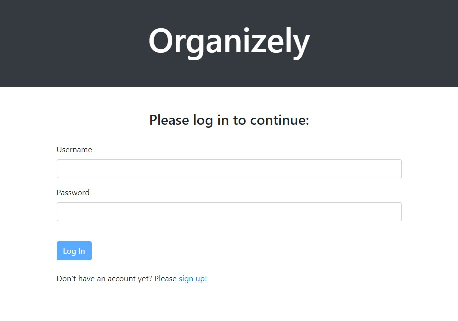
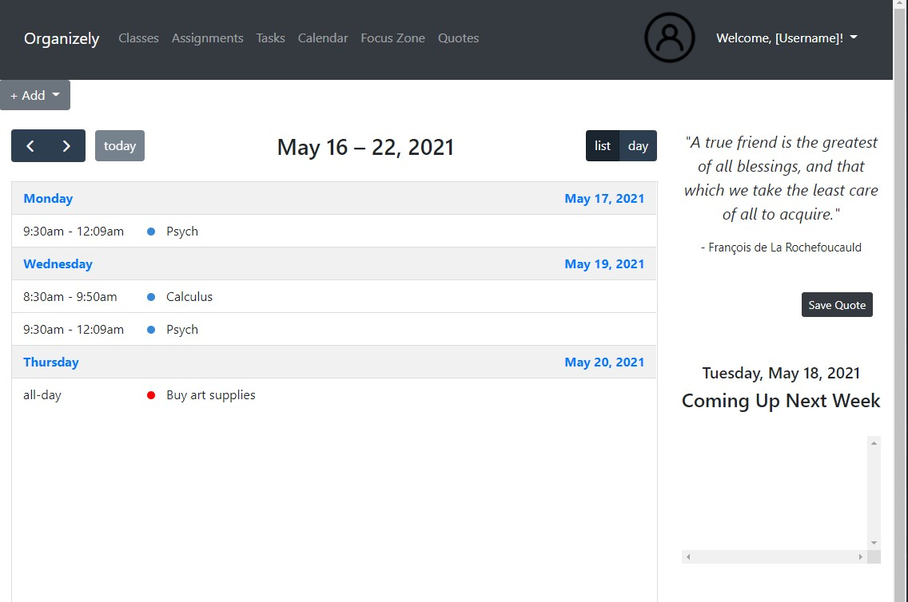
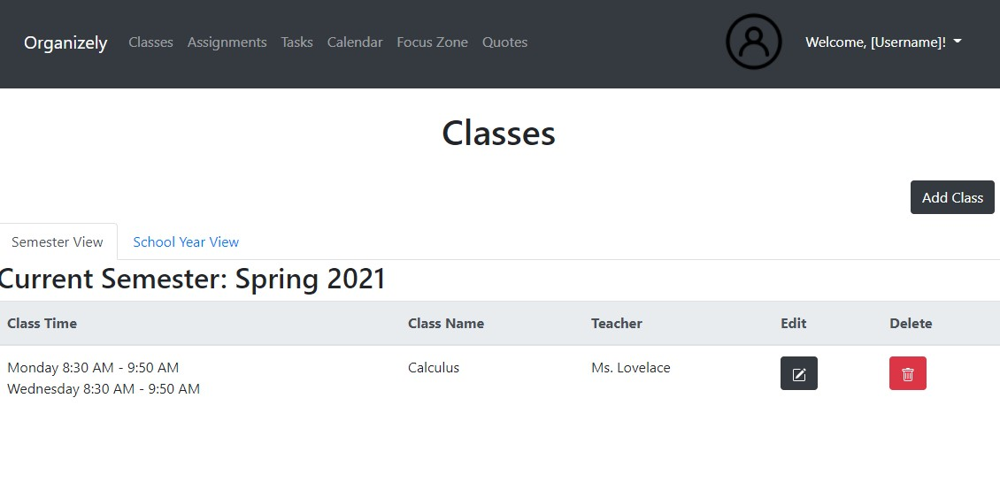
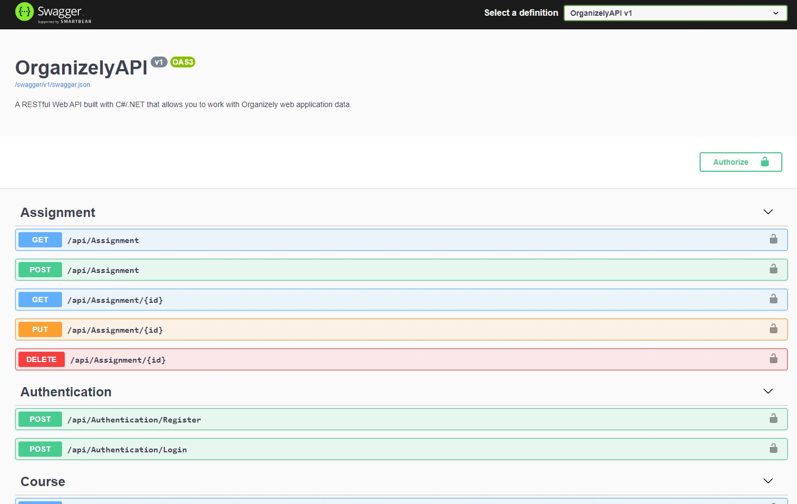
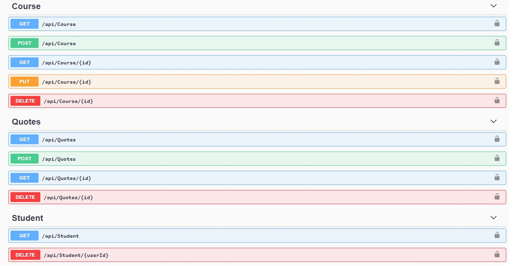
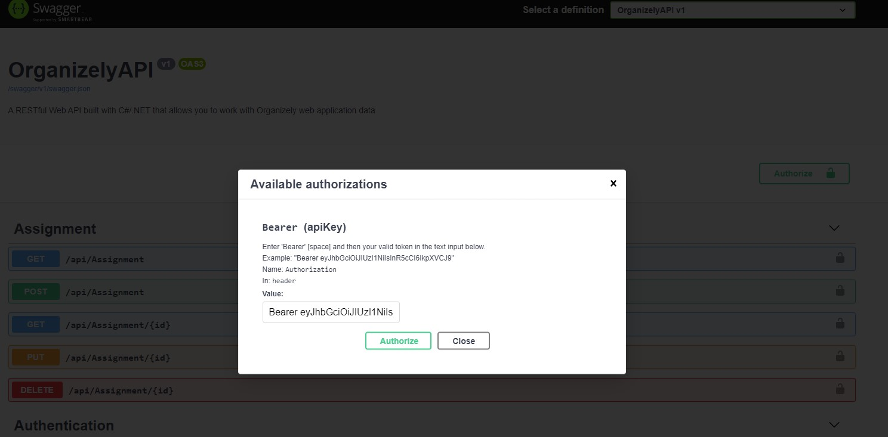

# Organizely

## Overview

Organizely will help college students manage their coursework online. Students will be able to add and view their classes on their personal accounts. Students will also be able to mark class and assignment due dates on their calendars and receive reminders. To help with structuring study time, students will have access to a Focus Zone where students will be able to use a Pomodoro Timer to help maintain focus during studying, as well as be able to track their study sessions. For daily affirmations, students can view and save inspirational quotes to their accounts.


## Features

- Create, Read, Edit, and Delete Classes
- Create, Read, Edit, and Delete Study Tasks and Assignments
- View User Profile
- View Calendar (Daily, Weekly, Monthly Views)
- Signup and Login with Authentication
- View and Save Inspirational Quotes

  
## Tech Stack

**Client:**

- Angular
- TypeScript
- Bootstrap 4
- HTML5
- CSS3

**Server:** 

- C#
- ASP.NET 5
- SQLite
- Entity Framework Core
- Identity
- JSON Web Token
- Swagger UI


## Authors

**Front-End**

- [Angela Mitchell](https://github.com/amitchell05)
- [Kaja Grabowska](https://github.com/KajaGrabowska)

**Back-End**

- [Maricar Walters](https://github.com/mlwalters)
- [Andrea Pruitt](https://github.com/DreaP)


## Screenshots

**Registration and log in page to the front-end app built with Angular**



**Dashboard page**




**Classes page**




**Swagger User Interface for the Web API built with C#/.NET** 






**Swagger UI Bearer authentication**




## Run Locally

1. Clone the project

```bash
  git clone git@github.com:AKA-Liftoff-Group-2021/Organizely-App.git
```

2. Go to the project directory 

```bash
  cd Organizely-App
  cd Organizely
```

3. Install Angular dependencies

```bash
  npm install
  ng serve -o
```

4. To run the Web API, go to the project directory
- Using the command line
```bash
  cd Organizely-App
  cd OrganizelyAPI
  dotnet run
```
- Using Visual Studio
    1. Open OrganizelyAPI.sln
    2. Click on `Start Without Debugging` or run `IISExpress`


## License

[MIT](https://github.com/AKA-Liftoff-Group-2021/Organizely-App/blob/main/LICENSE)

  

